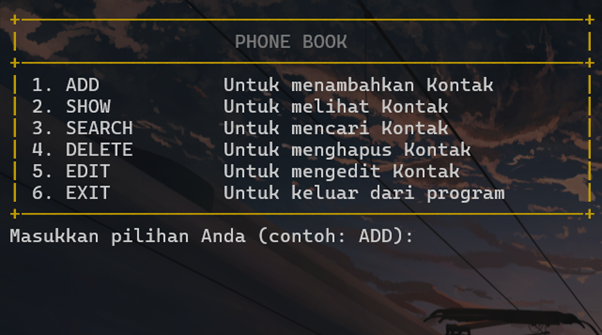

# Simple Phonebook

Proyek ini digunakan untuk memenuhi implementasi OOP pada Aksantara dengan membuat Phonebook sederhana untuk menyimpan dan melihat kontak pengguna dengan total maksimal 8 pengguna



## Instalasi / Memulai

Untuk memulai proyek ini, silakan clone repository ini dengan menjalankan perintah di bawah ini pada direktori Anda.

```shell
git clone https://github.com/ryonlunar/phonebook.git
``` 

Sebelum menjalankan program, silahkan compile program terlebih dahulu menggunakan compiler C++:

```shell
g++ telephone.cpp .\telephone.cpp -o main.exe
```

Dan dapat menjalankan program dengan menggunakan perintah berikut:

```shell
./main.exe
```
## Fitur

Program ini memiliki beberapa fitur utama.
* **Mengelola Kontak**: Pengguna dapat menambahkan, menghapus, dan mengedit kontak pada program. 
* **Mencari Kontak**: Kontak yang ada pada program dapat dicari oleh pengguna berdasarkan 


## Contributing

Program ini dibuat oleh

* **Adhimas Aryo Bimo - 13523052**

## License

[MIT](https://choosealicense.com/licenses/mit/)
